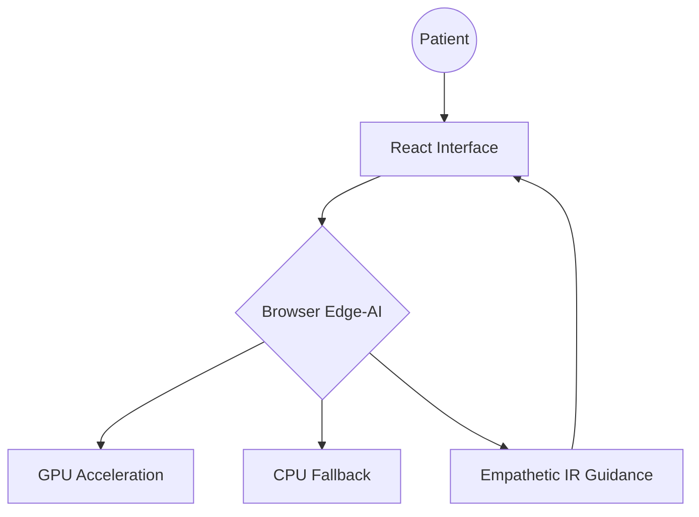

# 🩺 IR Patient Guide: Local-First Edition
### *Empowering Patients with Private, Edge-AI Medical Knowledge*

[](https://opensource.org/licenses/MIT)
[](https://react.dev/)
[](https://huggingface.co/docs/transformers.js)
[](https://github.com/drlighthunter/IR-Guide-Local-Deploy)

A fully self-contained, embeddable Interventional Radiology (IR) patient assistant. Unlike traditional chatbots, this application performs **zero API calls** to AI servers. All reasoning, translation, and medical guidance happen directly in the user's browser using Edge-AI technology.

---

## 🌟 Key Features

- **🛡️ Total Privacy:** No medical data, symptoms, or demographics ever leave the patient's device.
- **⚡ edge-AI Engine:** Runs `Qwen1.5-0.5B-Chat` locally via WebGPU/Wasm.
- **🌍 Multilingual Support:** Native support for 10 Indian languages (English, Hindi, Kannada, Tamil, Telugu, Malayalam, Oriya, Bangla, Marathi, Gujarati).
- **🗣️ Local TTS:** Built-in text-to-speech for accessible patient communication.
- **📦 Zero-API Dependency:** No OpenAI/Gemini/Anthropic keys required. No monthly billing. No downtime.
- **🧩 Ultra-Embeddable:** Designed to be dropped into existing hospital websites, social media widgets, or mobile web-views.

---

## 🎨 Interface Preview



---

## 🛠️ Technology Stack

| Component | Technology |
| :--- | :--- |
| **Frontend** | React 19 + TypeScript |
| **Styling** | Tailwind CSS 4 |
| **AI Runtime** | Transformers.js (Hugging Face) |
| **AI Model** | Qwen1.5-0.5B (Quantized 4-bit) |
| **Animations** | Motion |
| **Icons** | Lucide-React |

---

## 🚀 Quick Start

### Installation
```bash
git clone https://github.com/drlighthunter/IR-Guide-Local-Deploy.git
cd IR-Guide-Local-Deploy
npm install
```

### Development
```bash
npm run dev
```

### Production Build (Optimized for Embedding)
```bash
npm run build
```
*The output in the `/dist` folder is static and ready for hosting on GitHub Pages, Vercel, or any hospital server.*

---

## 🏥 Use Cases

1. **Hospital Websites:** Embed as a persistent floating bubble to answer pre-op questions.
2. **Kiosk Mode:** Run on tablets in the IR waiting room for patient education.
3. **Low-Bandwidth Areas:** Once the model (~350MB) is cached, the AI works entirely offline.
4. **Research:** Use as a template for private medical AI tools that require strict data sovereignty.

---

## ⚖️ Disclaimer

*This application is a proof-of-concept for educational purposes. The AI provides information regarding Interventional Radiology procedures but does not provide medical diagnosis or treatment plans. Always consult with a qualified physician for clinical advice.*

---

**Developed by [Dr. Sunil Kalmath](https://github.com/drlighthunter)**  
*Bridging the gap between Clinical Excellence and Edge Computing.*
